# Schema ER Diagram

> **Auto-generated** by `scripts/gen-api-docs.ts`. Do not edit by hand. Run `npx tsx scripts/gen-api-docs.ts` to regenerate.

**54 tables.**

## Mermaid diagram

```mermaid
erDiagram
  people {
    int id PK
  }
  jobs {
    int id PK
  }
  salary_changes {
    int id PK
  }
  contribution_accounts {
    int id PK
  }
  contribution_limits {
    int id PK
  }
  paycheck_deductions {
    int id PK
  }
  budget_profiles {
    int id PK
  }
  budget_items {
    int id PK
  }
  savings_goals {
    int id PK
  }
  savings_monthly {
    int id PK
  }
  savings_planned_transactions {
    int id PK
  }
  savings_allocation_overrides {
    int id PK
  }
  brokerage_goals {
    int id PK
  }
  brokerage_planned_transactions {
    int id PK
  }
  self_loans {
    int id PK
  }
  performance_accounts {
    int id PK
  }
  portfolio_snapshots {
    int id PK
  }
  portfolio_accounts {
    int id PK
  }
  annual_performance {
    int id PK
  }
  account_performance {
    int id PK
  }
  net_worth_annual {
    int id PK
  }
  home_improvement_items {
    int id PK
  }
  other_asset_items {
    int id PK
  }
  historical_notes {
    int id PK
  }
  mortgage_loans {
    int id PK
  }
  mortgage_what_if_scenarios {
    int id PK
  }
  mortgage_extra_payments {
    int id PK
  }
  property_taxes {
    int id PK
  }
  retirement_settings {
    int id PK
  }
  retirement_salary_overrides {
    int id PK
  }
  retirement_budget_overrides {
    int id PK
  }
  projection_overrides {
    int id PK
  }
  retirement_scenarios {
    int id PK
  }
  return_rate_table {
    int id PK
  }
  tax_brackets {
    int id PK
  }
  ltcg_brackets {
    int id PK
  }
  irmaa_brackets {
    int id PK
  }
  api_connections {
    int id PK
  }
  budget_api_cache {
    int id PK
  }
  app_settings {
    int id PK
  }
  local_admins {
    int id PK
  }
  relocation_scenarios {
    int id PK
  }
  scenarios {
    int id PK
  }
  asset_class_params {
    int id PK
  }
  asset_class_correlations {
    int id PK
  }
  glide_path_allocations {
    int id PK
  }
  mc_presets {
    int id PK
  }
  mc_preset_glide_paths {
    int id PK
  }
  mc_preset_return_overrides {
    int id PK
  }
  mc_user_presets {
    int id PK
  }
  contribution_profiles {
    int id PK
  }
  state_versions {
    int id PK
  }
  state_version_tables {
    int id PK
  }
  change_log {
    int id PK
  }
  jobs }o--|| people : references
  salary_changes }o--|| jobs : references
  contribution_accounts }o--|| jobs : references
  contribution_accounts }o--|| people : references
  paycheck_deductions }o--|| jobs : references
  budget_items }o--|| budget_profiles : references
  savings_monthly }o--|| savings_goals : references
  savings_planned_transactions }o--|| savings_goals : references
  savings_allocation_overrides }o--|| savings_goals : references
  brokerage_planned_transactions }o--|| brokerage_goals : references
  self_loans }o--|| savings_goals : references
  self_loans }o--|| savings_goals : references
  performance_accounts }o--|| people : references
  portfolio_accounts }o--|| portfolio_snapshots : references
  portfolio_accounts }o--|| people : references
  account_performance }o--|| people : references
  account_performance }o--|| performance_accounts : references
  mortgage_what_if_scenarios }o--|| mortgage_loans : references
  mortgage_extra_payments }o--|| mortgage_loans : references
  property_taxes }o--|| mortgage_loans : references
  retirement_settings }o--|| people : references
  retirement_salary_overrides }o--|| people : references
  retirement_budget_overrides }o--|| people : references
  asset_class_correlations }o--|| asset_class_params : references
  asset_class_correlations }o--|| asset_class_params : references
  glide_path_allocations }o--|| asset_class_params : references
  mc_preset_glide_paths }o--|| mc_presets : references
  mc_preset_glide_paths }o--|| asset_class_params : references
  mc_preset_return_overrides }o--|| mc_presets : references
  mc_preset_return_overrides }o--|| asset_class_params : references
  state_version_tables }o--|| state_versions : references
```

## Tables

- **account_performance** → people, performance_accounts
- **annual_performance**
- **api_connections**
- **app_settings**
- **asset_class_correlations** → asset_class_params, asset_class_params
- **asset_class_params**
- **brokerage_goals**
- **brokerage_planned_transactions** → brokerage_goals
- **budget_api_cache**
- **budget_items** → budget_profiles
- **budget_profiles**
- **change_log**
- **contribution_accounts** → jobs, people
- **contribution_limits**
- **contribution_profiles**
- **glide_path_allocations** → asset_class_params
- **historical_notes**
- **home_improvement_items**
- **irmaa_brackets**
- **jobs** → people
- **local_admins**
- **ltcg_brackets**
- **mc_preset_glide_paths** → mc_presets, asset_class_params
- **mc_preset_return_overrides** → mc_presets, asset_class_params
- **mc_presets**
- **mc_user_presets**
- **mortgage_extra_payments** → mortgage_loans
- **mortgage_loans**
- **mortgage_what_if_scenarios** → mortgage_loans
- **net_worth_annual**
- **other_asset_items**
- **paycheck_deductions** → jobs
- **people**
- **performance_accounts** → people
- **portfolio_accounts** → portfolio_snapshots, people
- **portfolio_snapshots**
- **projection_overrides**
- **property_taxes** → mortgage_loans
- **relocation_scenarios**
- **retirement_budget_overrides** → people
- **retirement_salary_overrides** → people
- **retirement_scenarios**
- **retirement_settings** → people
- **return_rate_table**
- **salary_changes** → jobs
- **savings_allocation_overrides** → savings_goals
- **savings_goals**
- **savings_monthly** → savings_goals
- **savings_planned_transactions** → savings_goals
- **scenarios**
- **self_loans** → savings_goals, savings_goals
- **state_version_tables** → state_versions
- **state_versions**
- **tax_brackets**
